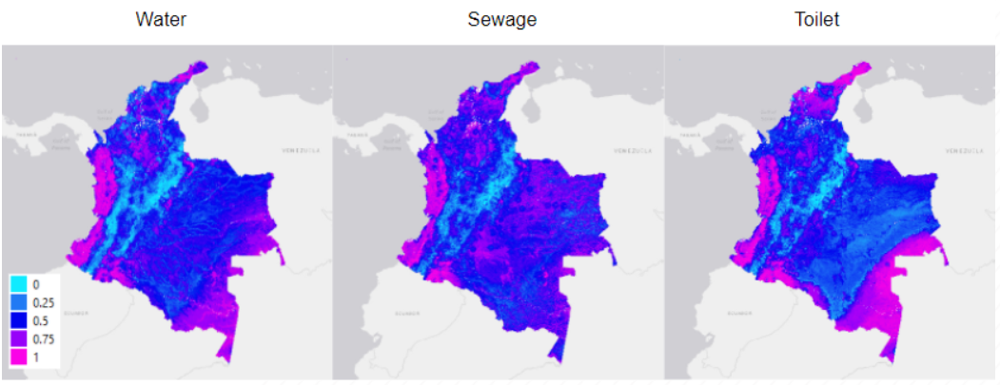

<p align="center">
<b><a href="#setup">Setup</a></b>
|
<b><a href="#code-organization">Code Organization</a></b>
|
<b><a href="#data">Data</a></b>
|
<b><a href="#acknowledgements">Acknowledgements</a></b>
</p>

# Geospatial Modeling of Access to Water and Sanitation

This repository accompanies our research work for Geospatial Modeling of WASH Access in Colombia.

The goal of this project is to provide a means for faster, cheaper, and more scalable survey of survey of the state of WASH access using satellite images and machine learning.



## Setup 
To get started, create a conda environment as follows:
```sh
pip install -r requirements.txt
```

Notable dependencies include:
- Anaconda3-2019.10
- earthengine-api==0.1.223
- gdal==3.1.0

## Code Organization
This repository is divided into three main parts:

- **notebooks/**: contains all Jupyter notebooks for data processing and model experimentation
- **scripts/**: contains scripts that are part of the main workflow in **notebooks/**
- **utils/**: contains utility scripts for geospatial data pre-processing and modeling

## Data
If you need the dataset used for training, please contact ThinkingMachines or IMMAP at hello@thinkingmachin.es, info@immap.org.

## Acknowledgments
This work is supported by the [iMMAP Colombia](https://immap.org/colombia/).